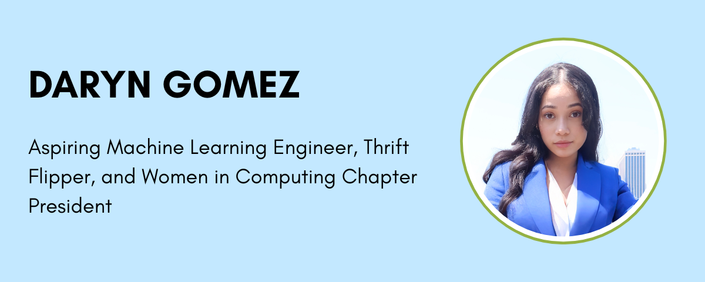

# Hi there, I'm Darlyn Gomez!

**Computer Science Student @ RIT | Cornell Tech AI Fellow | Former SWE Intern @ Blackstone**

I'm an aspiring machine learning engineer passionate about removing algorithmic bias in high-risk environments like crime, healthcare, and finance. I love tackling real-world problems through data analysis and predictive modeling, but I'm also big on continuously learning and building my skills through hands-on projects.

My journey bridges software engineering experience at Blackstone with data science research focused on women's retention in STEM. I've been selected for the Cornell Tech AI Fellowship and the ALPFA Fellowship, opportunities that have helped me grow both as a technical problem-solver and an inclusive leader.

**Currently:** Completing Break Through Tech AI Studio program, developing ML solutions for real-world industry challenges

## Featured Project: AI Studio Project - Coming Fall 2025
*This space reserved for my collaborative machine learning project solving real-world industry challenges with Cornell Tech mentorship.*

## Key Projects

### Campus Career Compass
**1st Place Winner - BMCC AI Innovation Challenge**
- AI-driven HR onboarding platform increasing efficiency by 50%
- Led team of 4 women developers in 2-day hackathon
- **Tech Stack:** JavaScript, HTML, CSS, AI integration
- **Impact:** Modernized flawed onboarding process affecting student success
- [View Project](https://github.com/DarlynGomez/MYND)

### Women in STEM Retention Analysis
**2nd Place - CCSCNE Undergraduate Research Competition**
- ML analysis of BMCC course data to identify retention factors
- Built predictive models for community college STEM interventions
- **Tech Stack:** Python, pandas, scikit-learn, data visualization
- **Collaboration:** Worked with Giovanna Rodriguez under Dr. Mohammad Azhar's mentorship

### Blackstone Data Visualization Dashboard
**Production Deployment - January 2025**
- Integrated DealCloud and Axiom data via Splunk Cloud
- Improved stakeholder data accessibility by 40%
- **Tech Stack:** SPL, Snowflake, AWS Lambda, Splunk
- **Methodology:** Agile sprints, real-time monitoring with custom KPIs

### C++ Student E-commerce Platform
**Full-Stack Secure Marketplace for Academic Materials**
- Built secure trading platform with SHA-256 password hashing and student email verification
- Designed real-time listing system with Qt6 and SQLite for fast search and filtering
- Implemented async UI with QPropertyAnimation and MVC architecture
- **Tech Stack:** C++, Qt6, SQLite, QHash, QDateTime
- **Impact:** Streamlined academic material exchange for BMCC students
- [View Project](https://github.com/DarlynGomez/BMCC-Student-Shop)

## Tech Stack

**Programming Languages:** Python, JavaScript, C++, HTML, CSS
**ML/Data Science:** pandas, scikit-learn, TensorFlow, NumPy, matplotlib
**Web Development:** React, Node.js, MongoDB, Bootstrap
**Cloud & Tools:** AWS Lambda, Splunk, Snowflake, Jupyter Notebooks, Git/GitHub
**Databases:** SQL, MySQL

## What I'm Currently Learning
- Advanced deep learning techniques through Cornell Tech AI curriculum
- MLOps and model deployment best practices
- Contributing to open-source ML projects
- Cloud deployment with AWS and Azure

## Certifications & Recognition
- **Break Through Tech AI Fellow** - Cornell Tech (2025)
- **Machine Learning Foundations Certificate** - Break Through Tech (Summer 2025)
- **ALPFA CUNY Fellow** - Association of Latino Professionals For America (2025)
- **C++ Templates and STL** - LinkedIn Learning (Dec 2024)
- **C++ Best Practices for Developers** - LinkedIn Learning (Dec 2024)
- **Mental Health First Aid USA** - National Council for Mental Wellbeing (2024-2027)

## Leadership & Community Impact
- **President, Women in Computing @ BMCC** - Leading 22 women in tech with 85% retention rate; organized and led workshops, tech panels with industry leaders, and computing festivities
- **ACM Europe Summer School on Data Science Participant** - Week-long intensive program in Europe covering cutting-edge data science techniques and research methodologies
- **Break Through Tech Fellow** - Developing technical skills and professional leadership through industry mentorship
- **Research Leader** - Conducting ML research on women's retention in STEM programs

## Career Goals
Seeking **Machine Learning Engineering** roles where I can:
- Apply ML models to solve real-world problems ethically
- Build inclusive AI systems that serve diverse communities
- Mentor other underrepresented technologists
- Continue growing as a technical leader in ML/AI

## Connect With Me
- **LinkedIn:** https://www.linkedin.com/in/darlyn-gomez/
- **Email:** darlyngomez89@gmail.com
- **GitHub:** [DarlynGomez](https://github.com/DarlynGomez)

## Fun Fact

When I'm not coding or leading tech initiatives, you can find me thrift flipping cute clothes, exploring the latest in AI ethics discussions, or discovering new spots around NYC!
